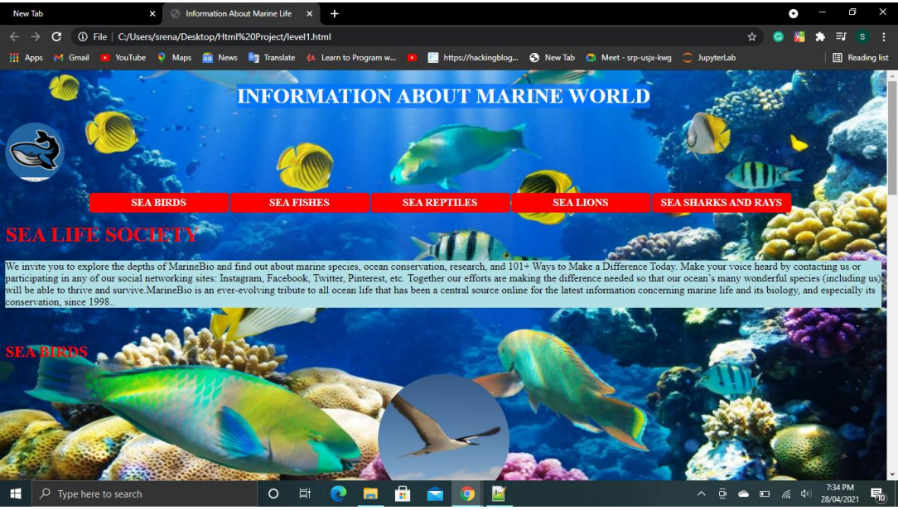
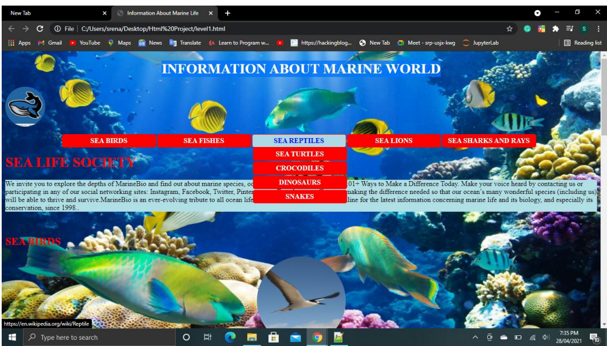
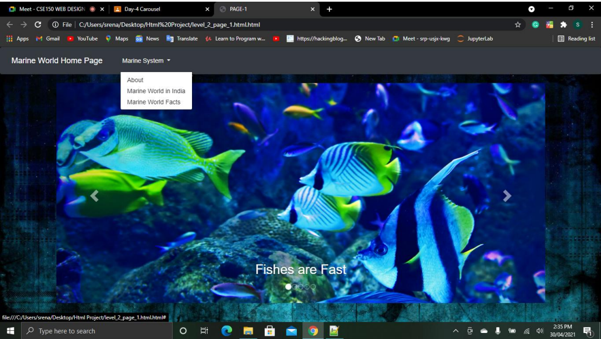

<h1>Sret-Angular-Marine-World</h1>

This is a responsive Angular web page with two-way binding and routing. The project has been divided into 5 levels for easy understanding and efficient coding challenges.

<h2>Project Details</h2>

The project was developed using Angular, and the following features were implemented:

<ul>
  <li>Two-way binding</li>
  <li>Routing</li>
  <li>Responsive design</li>
  <li>Modular architecture</li>
  <li>Optimized code for efficiency and maintainability</li>
</ul>

<h2>Project Structure</h2>

The project is divided into the following levels:

<ol>
  <li>Level 1 - Creating Components</li>
  <li>Level 2 - Adding Routing and Navigation</li>
  <li>Level 3 - Building Services</li>
  <li>Level 4 - Forms and Validations</li>
  <li>Level 5 - Integrating with Backend API</li>
</ol>

<h2>Getting Started</h2>

To get started with the project, follow these steps:

<ol>
  <li>Clone the repository</li>
  <li>Install dependencies by running `npm install` in the project root directory</li>
  <li>Run the project using `ng serve`</li>
  <li>Access the application at `http://localhost:4200/`</li>
</ol>

<h2>Screenshots</h2>

Below are some screenshots of the project:

<h2>Conclusion</h2>

Thank you for checking out my project! If you have any questions or suggestions, feel free to reach out to me.

